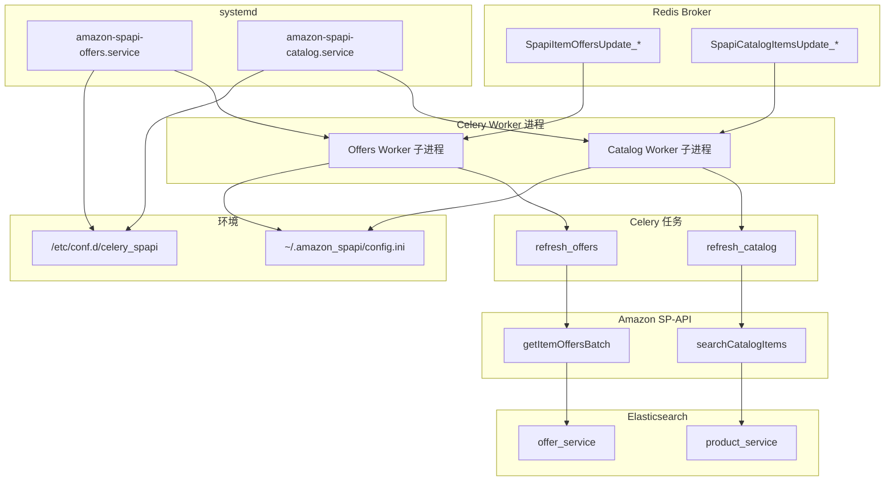

# systemd 服务执行路径说明

本文说明 `amazon-spapi-offers` 与 `amazon-spapi-catalog` 两个 systemd 服务从启动到处理一条任务的**完整代码执行路径**。便于排障时对照日志、队列名、ES 索引与源码位置。

相关文件：

| 类型 | 路径 |
|------|------|
| systemd 单元 | `deploy/systemd/amazon-spapi-offers.service` |
| systemd 单元 | `deploy/systemd/amazon-spapi-catalog.service` |
| 环境变量 | `/etc/conf.d/celery_spapi` |
| 业务配置 | `~/.amazon_spapi/config.ini`（或 `AMAZON_SPAPI_CONFIG_PATH`） |
| Celery 入口 | `amazon_spapi/worker/app.py` |
| Celery 配置 | `amazon_spapi/worker/settings.py` |

---

## 总览

两个服务的**进程模型相同**，区别仅在于：

| 项目 | `amazon-spapi-offers` | `amazon-spapi-catalog` |
|------|------------------------|-------------------------|
| 监听队列 | `OFFERS_QUEUES`（如 `SpapiItemOffersUpdate_US,...`） | `CATALOG_QUEUES`（如 `SpapiCatalogItemsUpdate_US,...`） |
| Worker 节点名 | `OFFERS_WORKER_NAME@主机` | `CATALOG_WORKER_NAME@主机` |
| 子进程并发 | `OFFERS_CONCURRENCY` | `CATALOG_CONCURRENCY` |
| 处理的任务 | `refresh_offers` | `refresh_catalog` |
| Amazon API | `getItemOffersBatch`（Pricing） | `searchCatalogItems`（Catalog Items） |
| 写入 ES | `[offer_service]` 报价索引 | `[product_service]` 商品目录索引 |



**调度端（入队）** 通常不在 VPS 上跑 systemd，而是由 cron/本机脚本把任务写入 Redis；worker 只负责**消费队列**。

---

## 第一阶段：systemd 启动进程

以 `amazon-spapi-offers` 为例（catalog 对称，仅变量名不同）。

### 步骤 1 — systemd 读取单元文件

文件：`deploy/systemd/amazon-spapi-offers.service`

| 配置项 | 作用 |
|--------|------|
| `User=Admin` | 以指定用户运行，读取其 `~/.amazon_spapi/config.ini` |
| `WorkingDirectory=/home/Admin/src/em-workers` | 项目根目录，`uv` 在此找到 `pyproject.toml` |
| `EnvironmentFile=/etc/conf.d/celery_spapi` | 注入 `BROKER_URL`、`OFFERS_*`、`AMAZON_SPAPI_CONFIG_PATH` 等 |
| `ExecStart=... uv run celery ...` | 实际启动命令 |
| `Restart=always` | 崩溃 15 秒后自动拉起 |

### 步骤 2 — 展开环境变量，构造 Celery 命令

systemd 将 `ExecStart` 展开为类似：

```bash
/home/Admin/.local/bin/uv run celery -A amazon_spapi.worker worker \
  -n c845us-offers@c845us \
  -l info \
  -c 1 \
  -Q SpapiItemOffersUpdate_US,SpapiItemOffersUpdate_CA,SpapiItemOffersUpdate_MX
```

| 参数 | 来源 | 含义 |
|------|------|------|
| `-A amazon_spapi.worker` | 固定 | Celery app 模块路径 |
| `-n ${OFFERS_WORKER_NAME}@%h` | `celery_spapi` | Worker 在集群中的唯一名字，出现在 `inspect ping`、监控 ES |
| `-l ${CELERY_LOG_LEVEL}` | `celery_spapi` | 日志级别，输出到 journald |
| `-c ${OFFERS_CONCURRENCY}` | `celery_spapi` | **子进程数**；每个子进程独立消费任务 |
| `-Q ${OFFERS_QUEUES}` | `celery_spapi` | 只从这些 Redis 队列取任务 |

`amazon-spapi-catalog` 使用 `CATALOG_WORKER_NAME`、`CATALOG_CONCURRENCY`、`CATALOG_QUEUES`，其余相同。

### 步骤 3 — `uv run` 启动 Python

1. 进入 `WorkingDirectory`
2. 使用项目 `.venv` 中的依赖
3. 执行 `celery` CLI，加载模块 `amazon_spapi.worker`

---

## 第二阶段：Celery 应用初始化

代码路径：`amazon_spapi/worker/app.py` → `amazon_spapi/worker/settings.py`

### 步骤 4 — 创建 Celery app

`amazon_spapi/worker/app.py`：

```python
app = Celery("amazon_spapi", include=HANDLER_MODULES)
app.config_from_object("amazon_spapi.worker.settings")
```

| 动作 | 说明 |
|------|------|
| `include=HANDLER_MODULES` | 注册三个任务模块：`refresh_offers`、`refresh_catalog`、`fetch_products` |
| `config_from_object(settings)` | 加载 broker、ack 策略、优先级、限速等 |

**注意：** 两个 systemd 服务都会 `include` 全部三个任务模块，但各自 `-Q` 只订阅自己的队列，因此 **offers 进程实际上只会收到 `refresh_offers` 任务**，catalog 进程只会收到 `refresh_catalog` 任务（除非手动往错误队列发任务）。

### 步骤 5 — 加载 `settings.py`

`amazon_spapi/worker/settings.py` 关键项：

| 配置 | 值 / 来源 | 作用 |
|------|-----------|------|
| `broker_url` | `get_broker_url()` ← 环境变量 `BROKER_URL` | 连接 Redis |
| `task_acks_late = True` | 固定 | 任务执行成功后才 ack；崩溃可重新入队 |
| `task_reject_on_worker_lost = True` | 固定 | Worker 丢失时任务退回队列 |
| `worker_prefetch_multiplier = 1` | 固定（**非** `celery_spapi` 环境变量） | 每个子进程最多预取 1 条未 ack 任务；全进程在手任务数 ≈ `-c` × 1。详见 [生产部署 — Prefetch](./生产部署.md#prefetch任务预取) |
| `task_annotations` | `get_task_rate_limits()` ← `OFFERS_TASK_RATE` / `CATALOG_TASK_RATE` | **每子进程** API 调用频率上限 |

`get_task_rate_limits()` 定义在 `amazon_spapi/config/workers.py`，从 `/etc/conf.d/celery_spapi` 读取，例如：

- `refresh_offers` → `16/m`（每子进程每分钟最多 16 次）
- `refresh_catalog` → `1/s`（每子进程每秒最多 1 次）

### 步骤 6 — Worker 主进程 fork 子进程

Celery 根据 `-c` 创建 N 个子进程。每个子进程触发一次 `worker_process_init` 信号。

### 步骤 7 — 子进程初始化（`worker_process_init`）

`amazon_spapi/worker/app.py` 中 `_on_worker_process_init`：

| 动作 | 代码 | 目的 |
|------|------|------|
| 初始化 Sentry | `init_sentry()` | 若 `config.ini` 配置了 `[sentry]`，上报异常 |
| 确保监控索引存在 | `ensure_worker_task_stats_indices()` | 在 `product_service` ES 创建 `spapi_task_stats_*` |
| 确保辅助索引 | `ensure_item_offers_aux_indices()` | 创建报价相关辅助索引 |

此时尚未连接 SP-API；SP-API 与 ES 在**任务执行时懒加载**。

### 步骤 8 — 子进程开始消费 Redis 队列

子进程阻塞在 broker 上，等待 `OFFERS_QUEUES` 或 `CATALOG_QUEUES` 中的消息。

---

## 第三阶段：任务如何进入队列（调度端，非 systemd）

Worker 本身不入队。任务由**调度脚本**写入 Redis。

### Offers 入队示例

命令：`uv run schedule-stale-offers -m us -q 20 -t 36 asins.txt`

| 步骤 | 文件 | 做什么 |
|------|------|--------|
| 1 | `commands/amazon/schedule_stale_offers.py` | 读 ASIN 文件，读 `BROKER_URL`，连接 ES `[offer_service]` |
| 2 | `amazon/offers/schedule_stale.py` | `StaleOfferEnqueueService` 过滤过期 ASIN（TTL 默认 36 小时） |
| 3 | 同上 | 每 **20 个 ASIN** 一批，调用 `dispatch_task(refresh_offers, ...)` |
| 4 | `scheduling/send.py` | `refresh_offers.apply_async(..., queue=SpapiItemOffersUpdate_US)` |
| 5 | Redis | 消息进入 `SpapiItemOffersUpdate_US` 列表 |

### Catalog 入队示例

命令：`uv run python -m amazon_spapi.commands.amazon.enqueue_catalog_from_asins -m us asins.txt`

| 步骤 | 文件 | 做什么 |
|------|------|--------|
| 1 | `commands/amazon/enqueue_catalog_from_asins.py` | 读 ASIN，按批入队 |
| 2 | `jobs/refresh_catalog.py` | `refresh_catalog.apply_async(..., queue=SpapiCatalogItemsUpdate_US)` |
| 3 | Redis | 消息进入 catalog 队列 |

队列名生成规则：`amazon_spapi/worker/queue_names.py`

- Offers：`SpapiItemOffersUpdate_{MARKET}`
- Catalog：`SpapiCatalogItemsUpdate_{MARKET}`

---

## 第四阶段：`amazon-spapi-offers` 处理一条任务

假设 Redis 中有一条 `refresh_offers` 消息：`marketplace=us`, `asins=[20个ASIN]`, `condition=new`。

### 步骤 9 — Celery 分发到子进程

子进程从 `SpapiItemOffersUpdate_US` 取出消息，反序列化为对 `refresh_offers` 的调用。

### 步骤 10 — 任务入口：`refresh_offers`

文件：`amazon_spapi/jobs/refresh_offers.py`

```python
@app.task(base=WorkerContext, bind=True, acks_late=True)
def refresh_offers(self, marketplace, asins, condition="new", ...):
```

| 要点 | 说明 |
|------|------|
| `base=WorkerContext` | 任务实例可访问 `self.spapi`、`self.offer_service` 等 |
| `bind=True` | 传入 `self`（Celery 请求上下文） |
| `acks_late=True` | 与 settings 一致，执行完才确认 |

### 步骤 11 — 懒加载依赖（`WorkerContext`）

文件：`amazon_spapi/worker/worker_deps.py`

首次访问时：

| 属性 | 加载内容 |
|------|----------|
| `self.cfg` | `get_config()` → 读 `~/.amazon_spapi/config.ini` |
| `self.spapi` | 用 `[spapi]` 凭证构造 `Spapi` 客户端 |
| `self.offer_service` | `get_offer_service()` → ES `[offer_service]` |
| `self.product_service` | `get_product_service()` → ES `[product_service]`（监控用） |
| `self.bot` | Telegram 告警（可选） |

### 步骤 12 — 构建业务用例

```python
use_case = RefreshMarketplaceOffers(
    self.spapi,
    self.offer_service,
    marketplace,
    asins,
    condition,
    product_service=self.product_service,
    worker=build_worker_meta(self.request),
)
use_case.run()
```

`build_worker_meta`（`worker/worker_meta.py`）从 Celery `request.hostname`（如 `c845us-offers@c845us`）提取 worker 身份，写入监控文档。

### 步骤 13 — 调用 Amazon API

文件：`amazon_spapi/amazon/offers/refresh.py` → `amazon_spapi/spapi/offers.py`

```
RefreshMarketplaceOffers.run()
  └─ spapi.get_item_offers_batch(marketplace, asins, condition)
       └─ Products API client (Pricing v0)
            └─ get_item_offers_batch(requests)   # 每个 ASIN 一个子请求，一次 batch 调用
                 └─ SpItemOfferBatchConverter.convert(responses)
```

| 层 | 文件 | 作用 |
|----|------|------|
| 业务 | `amazon/offers/refresh.py` | 重试、统计耗时、写 ES、记监控 |
| SP-API 封装 | `spapi/offers.py` | 组装 batch 请求、处理 429/403 |
| 底层库 | `python-amazon-sp-api` | LWA 换 token、AWS SigV4、HTTP |

凭证路径：`config.ini [spapi]` → `WorkerContext.spapi` → `spapi/client.py`（带重试包装的 `Products`）。

### 步骤 14 — 写入 Elasticsearch

仍在 `RefreshMarketplaceOffers.run()`：

```python
self.offer_service.save_item_offers(
    "lowest_offer_listings", offers, marketplace, condition
)
```

| 动作 | 说明 |
|------|------|
| 保存报价 | 写入 `[offer_service]` 配置的 ES 集群 |
| 清理无报价索引 | `delete_asins_from_no_offer_indices()` |
| 记录监控 | `WorkerTaskStatsRecorder.record_task()` → `spapi_task_stats_*` |

### 步骤 15 — 异常处理（任务层）

`refresh_offers` 捕获异常后的行为：

| 异常类型 | 行为 |
|----------|------|
| `SellingApiForbiddenException` / `AuthorizationError` | 广播 shutdown 本 worker、Telegram 告警、`Reject(requeue=True)` |
| `exceptions_to_retry`（含 429） | `Reject(requeue=True)` 重新入队 |
| `exceptions_not_retry` | `Ignore()` 丢弃任务 |
| 其他 | `Ignore()`，可选 Sentry |

### 步骤 16 — 确认消息

任务正常结束 → Celery ack → Redis 中该消息被删除。

---

## 第五阶段：`amazon-spapi-catalog` 处理一条任务

假设消息为 `refresh_catalog(marketplace=us, asins=[...])`。

### 步骤 9′ — 从 catalog 队列取任务

子进程监听 `SpapiCatalogItemsUpdate_US` 等（`CATALOG_QUEUES`）。

### 步骤 10′ — 任务入口：`refresh_catalog`

文件：`amazon_spapi/jobs/refresh_catalog.py`

结构与 `refresh_offers` 相同，业务类换为 `RefreshMarketplaceCatalog`。

### 步骤 11′ — `WorkerContext` 懒加载

与 offers 相同；catalog 任务主要用 `self.spapi` 和 `self.product_service`（不用 `offer_service`）。

### 步骤 12′ — 构建业务用例

文件：`amazon_spapi/amazon/catalog/refresh.py`

```python
RefreshMarketplaceCatalog(
    self.spapi,
    self.product_service,
    marketplace,
    asins,
    worker=build_worker_meta(self.request),
).run()
```

默认 ES 索引名：

- 商品目录：`amz_products_api_{marketplace}_v2`
- 缺失 ASIN：`amz_products_missing_{marketplace}`

### 步骤 13′ — 调用 Amazon Catalog API

```
RefreshMarketplaceCatalog.run()
  └─ search_and_parse_catalog_items(spapi, marketplace, asins)
       └─ spapi.search_catalog_items(asins, marketplace=...)
            └─ CatalogItems v2022-04-01.search_catalog_items(...)
       └─ SpapiCatalogItemsParser.parse(response)
```

| 层 | 文件 | 作用 |
|----|------|------|
| 业务 | `amazon/catalog/refresh.py` | 解析、写 ES、处理 missing ASIN |
| 解析 | `spapi/catalog_items.py` | 调用 + `SpapiCatalogItemsParser` |
| SP-API | `spapi/catalog.py` | `searchCatalogItems`，含重试 |

### 步骤 14′ — 写入 Elasticsearch

| 情况 | 动作 |
|------|------|
| API 返回商品 | `product_service.save_products("amz_products_api_us_v2", docs)` |
| API 未返回的 ASIN | 写入 `amz_products_missing_us` |
| 监控 | `WorkerTaskStatsRecorder` → `spapi_task_stats_*` |

### 步骤 15′ — 异常处理

与 offers 类似；403 时 shutdown + Telegram，可重试异常 requeue。

### 步骤 16′ — ack

成功或 `Ignore` 后确认消息。

---

## 配置与代码对照表

### `/etc/conf.d/celery_spapi` → 运行参数

| 环境变量 | 影响 |
|----------|------|
| `BROKER_URL` | Redis 地址；`settings.broker_url` |
| `AMAZON_SPAPI_CONFIG_PATH` | `config.ini` 路径 |
| `OFFERS_QUEUES` / `CATALOG_QUEUES` | systemd `ExecStart -Q` |
| `OFFERS_CONCURRENCY` / `CATALOG_CONCURRENCY` | systemd `ExecStart -c` |
| `OFFERS_WORKER_NAME` / `CATALOG_WORKER_NAME` | systemd `ExecStart -n` |
| `OFFERS_TASK_RATE` / `CATALOG_TASK_RATE` | Celery `task_annotations` 限速 |

### `~/.amazon_spapi/config.ini` → 运行时连接

| 配置段 | 消费者 |
|--------|--------|
| `[spapi]` | `WorkerContext.spapi` → 所有 Amazon API |
| `[offer_service]` | `refresh_offers` → 报价 ES |
| `[product_service]` | `refresh_catalog`、监控统计 ES |
| `[telegram]` | 403 等告警 |
| `[sentry]` | 异常上报 |

---

## 排障时按路径定位

| 现象 | 先查哪一层 |
|------|------------|
| `systemctl` 起不来 | systemd 单元、`celery_spapi` 引号/变量、路径 |
| Worker 在线但不消费 | `OFFERS_QUEUES` 是否与入队队列一致、`redis-cli LLEN 队列名` |
| 403 / 授权失败 | `config.ini [spapi]`、`amazon-spapi-test-auth` |
| 429 限流 | `OFFERS_TASK_RATE` / `CATALOG_TASK_RATE`、并发 `-c` |
| ES 无数据 | `offer_service` / `product_service` 配置、任务是否 `Ignore` |
| 监控无统计 | `product_service` 连通、`worker_process_init` 是否报错 |

### 常用命令

```bash
# 服务状态
sudo systemctl status amazon-spapi-offers amazon-spapi-catalog

# 日志（journald）
sudo journalctl -u amazon-spapi-offers -u amazon-spapi-catalog -f

# Worker 是否在线
set -a && source /etc/conf.d/celery_spapi && set +a
uv run celery -A amazon_spapi.worker inspect ping

# 队列积压
redis-cli -u "$BROKER_URL" LLEN SpapiItemOffersUpdate_US
```

---

## 源码索引（按调用顺序）

### 共用

1. `deploy/systemd/amazon-spapi-*.service` — systemd 定义
2. `amazon_spapi/worker/app.py` — Celery app、任务注册、子进程 init
3. `amazon_spapi/worker/settings.py` — broker、ack、限速
4. `amazon_spapi/config/env.py` — `BROKER_URL`
5. `amazon_spapi/config/workers.py` — 队列名、限速、worker 名
6. `amazon_spapi/worker/worker_deps.py` — 任务上下文（SP-API、ES）
7. `amazon_spapi/platform/__init__.py` — `get_config()`、`get_spapi()`

### Offers 专线

8. `amazon_spapi/scheduling/send.py` — 入队
9. `amazon_spapi/jobs/refresh_offers.py` — Celery 任务
10. `amazon_spapi/amazon/offers/refresh.py` — 业务用例
11. `amazon_spapi/spapi/offers.py` — SP-API batch 报价
12. `amazon_spapi/services/offer_service.py` — 写报价 ES

### Catalog 专线

8. `amazon_spapi/jobs/refresh_catalog.py` — Celery 任务
9. `amazon_spapi/amazon/catalog/refresh.py` — 业务用例
10. `amazon_spapi/spapi/catalog.py` — SP-API 目录搜索
11. `amazon_spapi/spapi/catalog_items.py` — 解析响应
12. `amazon_spapi/services/product_service.py` — 写商品 ES
